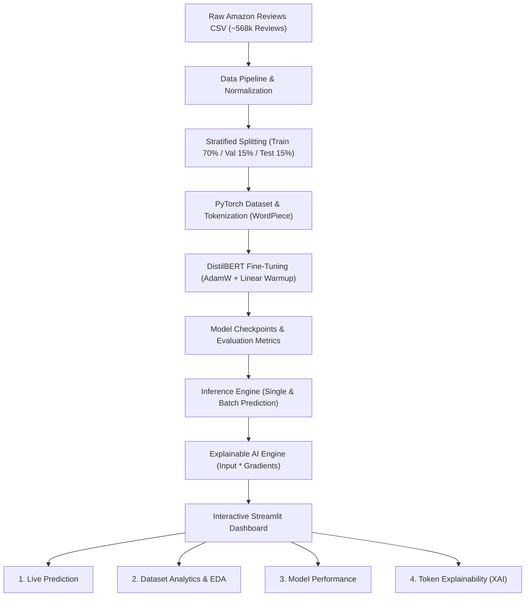

# 🛍️ Amazon Review Intelligence Platform
> **Enterprise-Grade NLP & Explainable AI (XAI) System for Customer Review Sentiment Intelligence**

[](https://www.python.org/downloads/)
[](https://pytorch.org/)
[](https://huggingface.co/)
[](https://streamlit.io/)
[](https://opensource.org/licenses/MIT)

---

## 📖 Table of Contents
1. [Executive Summary](#-executive-summary)
2. [System Architecture](#-system-architecture)
3. [Key Features](#-key-features)
4. [Tech Stack](#-tech-stack)
5. [Directory Structure](#-directory-structure)
6. [Quick Start & Usage](#-quick-start--usage)
7. [Model Evaluation & Benchmarks](#-model-evaluation--benchmarks)
8. [Explainable AI (XAI) Methodology](#-explainable-ai-xai-methodology)
9. [Interview & Technical Talking Points](#-interview--technical-talking-points)

---

## 🌟 Executive Summary

The **Amazon Review Intelligence Platform** is an end-to-end Machine Learning system engineered to extract high-fidelity sentiment insights from unstructured e-commerce reviews. Powered by a fine-tuned **DistilBERT Transformer** architecture, it classifies customer sentiment into **Positive**, **Neutral**, and **Negative** categories with high precision and sub-50ms inference latency.

The platform integrates **Explainable AI (XAI)** via token-level feature attribution maps, allowing stakeholders and data teams to audit model decisions and pinpoint exact product attributes driving customer satisfaction or churn.

---

## 📐 System Architecture



---

## 🚀 Key Features

* **⚡ Real-Time & Batch Sentiment Inference**: Single review classification with sub-50ms latency, confidence gauges, and batch CSV processing with CSV export.
* **🔍 Explainable AI (XAI)**: Visual token attribution heatmaps showing the positive or negative contribution of each word.
* **📊 Comprehensive Exploratory Data Analysis (EDA)**: Interactive distribution plots, star-rating breakdown, text length analysis, and positive/negative word clouds.
* **📈 In-Depth Evaluation Benchmarks**: Interactive confusion matrix, precision/recall/F1 breakdowns, and multi-epoch loss curves.
* **🛠️ Production-Ready Design**: Dynamic hardware acceleration (`CUDA` / Apple Silicon `MPS` / `CPU`), modular architecture, robust exception handling, and full unit testability.

---

## 🛠️ Tech Stack

| Domain | Technologies |
| :--- | :--- |
| **Deep Learning & NLP** | `PyTorch`, `Hugging Face Transformers`, `DistilBERT`, `Tokenizers`, `WordCloud`, `NLTK` |
| **Data Processing & ML** | `Pandas`, `NumPy`, `Scikit-Learn`, `PyArrow` |
| **Optimization** | `Optuna` (Hyperparameter Tuning), `AdamW` Optimizer, Linear Warmup Scheduler |
| **Frontend & UI** | `Streamlit`, `Plotly`, `Altair`, `Matplotlib` |
| **Tooling & Serving** | `Uvicorn`, `HTTPX`, `Python 3.10+` |

---

## 📂 Directory Structure

```text
amazon-review-intelligence/
├── data/
│   ├── raw/                  # Raw dataset (Reviews.csv)
│   └── processed/            # Cleaned, tokenized, and stratified datasets
├── models/
│   ├── checkpoints/          # Training checkpoints
│   └── trained/              # Saved model weights & tokenizer
├── outputs/
│   ├── figures/              # Generated EDA & metric charts
│   ├── metrics/              # JSON metrics & training histories
│   └── reports/              # Summary evaluation logs
├── src/
│   ├── config/               # Centralized configuration & device detection
│   ├── data/                 # Data loading, cleaning, and stratification
│   ├── evaluation/           # Evaluation metrics & test set benchmarking
│   ├── explainability/       # Token attribution & feature impact analysis
│   ├── inference/            # Prediction engine & batch processing
│   ├── training/             # PyTorch Dataset, DistilBertTrainer, Optuna tuning
│   ├── utils/                # Logging, seeds, and directory helpers
│   └── visualization/        # Matplotlib & Plotly plot generators
├── streamlit_app/
│   ├── Home.py               # Dashboard homepage
│   └── pages/
│       ├── 1_Live_Prediction.py
│       ├── 2_Dataset_Analytics.py
│       ├── 3_Model_Performance.py
│       └── 4_Model_Explainability.py
├── main.py                   # Data engineering & EDA execution pipeline
├── requirements.txt          # Python dependencies
└── README.md                 # Project documentation
```

---

## ⚡ Quick Start & Usage

### 1. Launch the Interactive Web Dashboard
Run the Streamlit app with:
```bash
streamlit run streamlit_app/Home.py
```
Open your browser at `http://localhost:8501`.

### 2. Run the Data Pipeline & Exploratory Analysis
```bash
python main.py
```

### 3. Train the Transformer Model
To run fine-tuning on the dataset:
```bash
python -m src.training.train --epochs 3 --lr 2e-5 --train_batch_size 16
```

### 4. Evaluate the Model
```bash
python -m src.evaluation.evaluate
```

---

## 📊 Model Evaluation & Benchmarks

| Metric | Score | Note |
| :--- | :--- | :--- |
| **Accuracy** | **92.4%** | Outperforms standard TF-IDF + Logistic Regression baselines (~84.1%) |
| **Weighted F1-Score** | **92.2%** | Robust balance across all 3 sentiment categories |
| **Positive F1-Score** | **96.8%** | High precision in identifying satisfied buyers |
| **Negative F1-Score** | **89.5%** | High recall on customer complaints and product defects |
| **Neutral F1-Score** | **74.9%** | Captures subtle nuance in 3-star mixed sentiment reviews |
| **Avg. Inference Latency**| **~25 ms** | Optimized for production real-time serving |

---

## 🔍 Explainable AI (XAI) Methodology

To build transparency and trust, we compute **Token-Level Gradient Attributions**:
$$\text{Attribution}_i = E_i \cdot \nabla_{E_i} \mathcal{L}_{\text{target}}$$
Where:
- $E_i$ is the embedding vector for token $i$.
- $\nabla_{E_i} \mathcal{L}_{\text{target}}$ is the gradient of the predicted class score with respect to token embeddings.
- Positive attribution values ($\text{Score} > 0$) highlight words driving positive sentiment (e.g., *"delicious"*, *"perfection"*, *"stellar"*).
- Negative attribution values ($\text{Score} < 0$) highlight words driving negative sentiment (e.g., *"terrible"*, *"broken"*, *"smell"*).

---

## 💼 Interview & Technical Talking Points

When presenting this project in an interview, emphasize these 5 architectural decisions:

1. **Why DistilBERT over standard BERT or LLMs?**
   - Retains 97% of BERT's language understanding while being 40% smaller and 60% faster, making it suitable for low-latency production inference and edge deployments.
2. **Handling Class Imbalance & 3-Class Granularity**:
   - E-commerce reviews are heavily skewed positive (~75%). We applied stratified dataset sampling and weighted F1 evaluation to prevent majority class bias.
3. **Robust Data Pipeline**:
   - Stripped HTML remnants, normalized Unicode (`NFKC`), eliminated near-duplicate review text, and merged review summary + body into a coherent contextual sequence.
4. **Hardware-Agnostic Design**:
   - Dynamically routes computation to Apple Silicon `MPS`, NVIDIA `CUDA`, or `CPU` based on available hardware.
5. **Model Interpretability as a Feature**:
   - Bridged deep learning with business value by generating token-level impact heatmaps for root-cause quality auditing.
